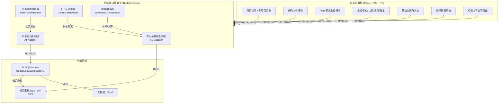
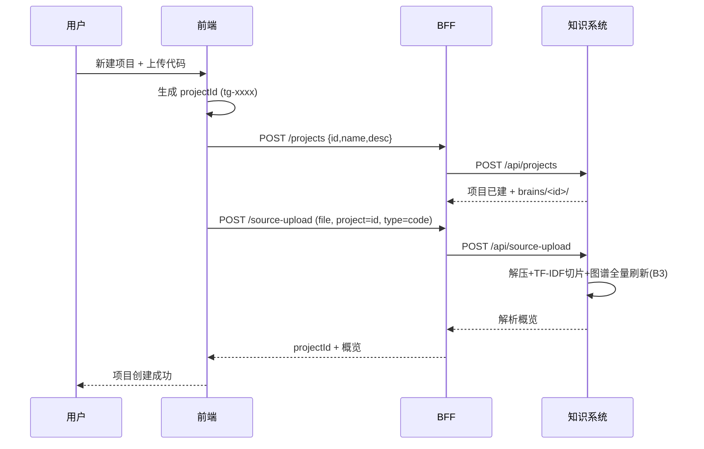
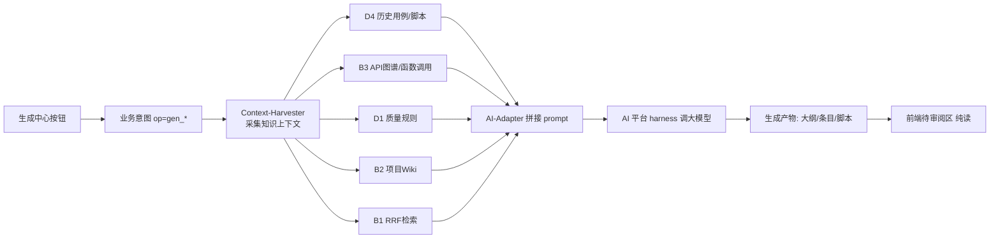
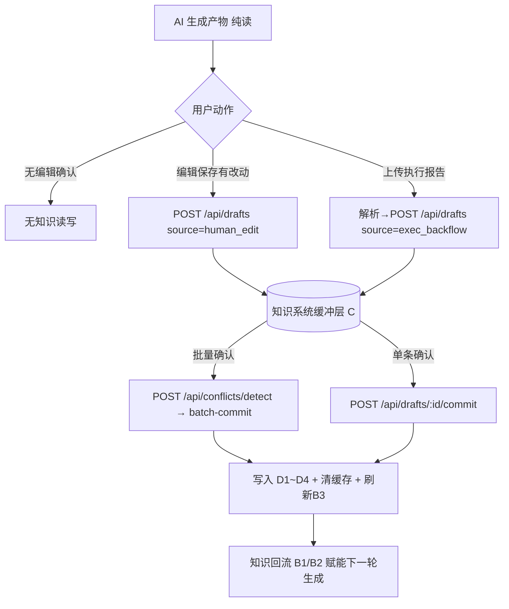
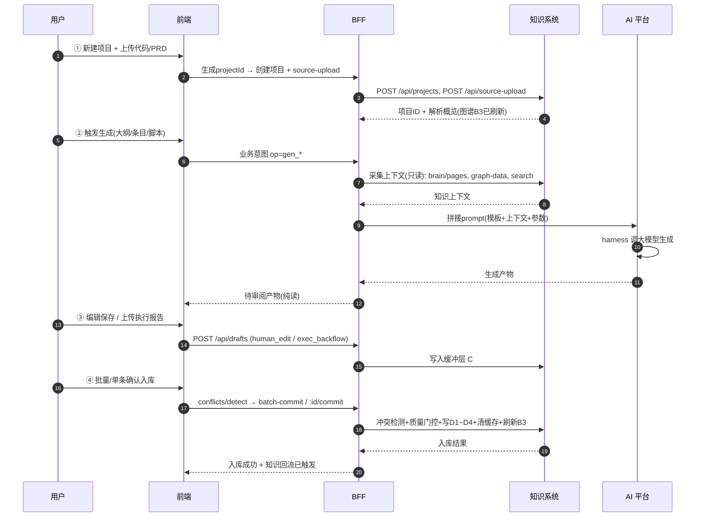

# 自动化测试用例生成 · 前端业务系统 — 架构设计与详细技术方案

> 项目代号：`testcase-gen-frontend`（产品名：**TestGen 智能测试用例工作台**）
> 定位：知识管理系统（test-knowledge-system）的**外部业务前端**，承载「自动化测试用例生成」的全部用户交互与业务编排逻辑。
> 版本基线：V1.0 单人本地多项目（对齐知识系统 V1.0 里程碑）

---

## 0. 文档目的与阅读导航

本文档是 TestGen 前端业务系统的权威设计来源，目标读者为开发、设计、测试与产品。内容组织： 

| 章节 | 内容 |
|------|------|
| 1. 系统定位与边界 | 在知识系统四层架构中的角色、不做什么 |
| 2. 全局架构 | 分层、与知识系统 / AI 平台的对接关系、三层 prompt 分离 |
| 3. 功能需求映射 | 6 项功能性要求的逐条落地设计 |
| 4. 关键业务流程 | 上传 / 生成 / 编辑 / 回流入库 的端到端时序 |
| 5. 前端架构 | 技术栈、模块划分、状态、多项目管理 |
| 6. 后端编排层（BFF） | 模块、知识系统 API 契约、AI 平台接入 |
| 7. 数据模型与接口契约 | 前端 ↔ BFF ↔ 知识系统 的接口约定 |
| 8. UI 设计原则 | 科技感 / 高级感 设计系统要点 |
| 9. 非功能性需求 | 性能 / 安全 / 可观测 / 兼容 |
| 10. 里程碑与开发计划摘要 | 与知识系统 V1.0 对齐的迭代节奏 |

详细的需求列表与开发计划见同目录 [`需求列表.md`](./需求列表.md) 与 [`开发计划.md`](./开发计划.md)；项目知识沉淀见 `wiki/` 目录（Karpathy LLM Wiki 构建）。

---

## 1. 系统定位与边界

### 1.1 在知识系统四层架构中的角色

知识系统总体架构明确定义了**业务侧（外部）**的角色：业务系统前端提交「业务意图」（操作类型 + 参数），由 AI 平台选择执行模板，知识系统仅提供知识查询/写入接口。TestGen 即这一「业务侧」的具体实现。

```
业务侧（TestGen 本系统）           AI 平台侧                      知识系统（test-knowledge-system）
┌────────────────────┐   业务意图   ┌────────────────┐  MCP/REST  ┌────────────────────────┐
│  TestGen 前端 + BFF │ ──────────▶ │ 执行模板+harness│ ─────────▶ │ L0 接入层(MCP+REST)     │
│  · 上传代码/PRD     │             │ · 拼接知识上下文│ ◀───────── │ L2 缓冲层(SQLite)       │
│  · 触发生成         │ ◀────────── │ · 调大模型生成  │  知识上下文 │ L3 GBrain 内核(Brain仓库)│
│  · 编辑/入库/回流   │   结果返回   │ · 写草稿        │            │  D1质量规则 D2缺陷经验   │
└────────────────────┘             └────────────────┘            │  D3项目Wiki D4历史用例   │
                                           │ REST 直连             └────────────────────────┘
                                           ▼
                                    TestGen 源数据上传/用户确认  ──▶ 知识系统 REST API（不经 AI 平台）
```

### 1.2 边界原则（继承自知识系统总体架构）

| 原则 | 本系统遵守方式 |
|------|----------------|
| **业务入口为按钮类确定性操作** | 所有操作均为按钮触发，提交「业务意图」（操作类型 + 参数），不提交完整 prompt |
| **三层 prompt 分离** | 业务意图（本系统管「做什么」）、执行模板（AI 平台管「怎么做」）、知识上下文（知识系统管「知道什么」）；换 AI 平台时本系统零改动 |
| **不重建 AI harness** | 工具调用、对话编排、上下文管理、大模型调用全部交给 AI 平台；本系统只做编排与上下文采集 |
| **不重建知识存储** | 所有知识落库均经由知识系统 REST/MCP，本系统不持有正式知识库 |
| **Web UI 仅管理，本系统承载日常消费** | 知识系统的 Web UI 只做知识库管理；TestGen 才是用例生成的日常使用界面 |

### 1.3 明确不做什么（Out of Scope for V1.0）

- 不实现知识图谱计算、RAG 检索、冲突检测、质量门控（复用知识系统）。
- 不实现大模型推理与多轮对话（复用 AI 平台 harness）。
- 不做团队协同 / 权限分级 / 涉密管控（V2.0+ 由知识系统安全治理层负责）。
- 不替换 GBrain 内核或知识系统缓冲层。

---

## 2. 全局架构

### 2.1 分层架构（TestGen 自身）

TestGen 由「前端应用层」+「后端编排层（BFF）」组成，BFF 是「前端业务逻辑」的核心载体。



### 2.2 两条对接路径（严格对齐知识系统架构）

| 路径 | 触发场景 | 链路 | 是否经 AI 平台 |
|------|----------|------|----------------|
| **路径 A：确定性生成路径** | 触发用例大纲/条目/脚本生成 | 前端 → BFF 业务意图 → AI 平台执行模板 → MCP 读知识系统 → 大模型生成 → MCP 写草稿 → 返回前端 | ✅ 经 AI 平台 |
| **路径 B：源数据/确认路径** | 上传代码/PRD、编辑保存、批量/单条入库、冲突处理 | 前端 → BFF → 知识系统 REST API（直连，不经 AI 平台） | ❌ 直连知识系统 |

> 关键：**纯展示/删除/导出/无修改确认** 等无知识变更操作仅做本地业务交互，不调用任何写库接口（对齐 PRD 1.3 范围界定）。

### 2.3 三层 prompt 分离落地

| 层 | 归属 | V1.0 实现载体 | 内容示例 |
|----|------|---------------|----------|
| 业务意图 | TestGen 前端/BFF | 业务意图 JSON（见 §7.3） | `{op:'gen_cases', project:'p1', prdId, codeRef, scope}` |
| 执行模板 | AI 平台 | Agent 执行模板 / prompt 文件 | 「你是测试用例专家，先查质量规则库，再查 API 图谱…」 |
| 知识上下文 | 知识系统 | RRF 检索 + 图谱 + Brain 页面 | 通过 BFF 上下文采集器聚合后注入 |

---

## 3. 功能需求映射（6 项逐条落地）

### 需求 1：用户上传待测试项目代码接口，自动生成项目 ID

**用户操作**：在前端「项目空间」点击「新建测试项目」→ 上传代码压缩包（zip/tar(.gz/.bz2/.xz)/7z）或单个代码文件。

**落地设计**：
1. 前端生成项目 ID（规则：`tg-` + 时间戳 36 进制 + 4 位随机，保证本地唯一），并采集项目名/描述。
2. BFF `KS-Adapter` 调用知识系统 `POST /api/projects` 创建项目（知识系统据此建立 `brains/<id>/` 目录与多项目配置）。
3. BFF 调用知识系统 `POST /api/source-upload`（multipart，字段 `file` + `project` + `type=code`）上传代码；知识系统 `code_upload_parser.py` 自动解压、解析、切片，并触发 API 依赖图谱（B3）全量刷新。
4. 返回项目 ID 与解析概览（文件数、识别出的接口/方法数）给前端。



> 代码与项目 ID 的「上传与生成」**完全由知识系统 API 完成**，本系统只做编排与 ID 生成策略。

### 需求 2：上传 PRD、需求文档等入口，实际通过知识系统端口上传

**用户操作**：在「项目空间 → 资料库」上传 PRD / 需求文档 / 流程图（支持 .md/.txt/.pdf 文本类）。

**落地设计**：
- 文本类（PRD/需求）：BFF 调用 `POST /api/source-upload`（`type=prd` 或 `type=requirement`，`content` 体内联或文件上传），知识系统将其作为源数据写入 `brains/<id>/project-wiki/` 或将正文落入缓冲层待入库。
- 与需求 1 共用同一个 `KS-Adapter.sourceUpload()` 方法，仅 `type` 参数不同。
- 上传后，PRD 内容进入 B2（LM Wiki 项目知识库）与图谱增量更新链路，作为后续生成的业务上下文。

### 需求 3：与知识系统里程碑契合，支持单人本地多项目管理

**对齐点**：知识系统 V1.0 已提供 `GET/POST/DELETE /api/projects` 与 `resolveProject()` 多项目隔离（私有 `brains/<id>/` + 可选 `sharedBrain`）。

**落地设计（复用知识系统 web/src/app.js 的多项目模式）**：
- 全局 `currentProject` 状态，持久化到 `localStorage['tg_currentProject']`。
- 所有 BFF 请求自动注入 `?project=<currentProject>`（URL）或 body 字段（REST）；若调用方已显式指定则尊重原值（便于导入弹窗覆盖目标项目）。
- 顶部栏「项目切换器」：调用 `GET /api/projects` 填充下拉，`onProjectChange` 时重置图谱缓存、分页、生成结果与草稿列表，刷新角标。
- 本地隔离：每个项目对应独立 `brains/<id>/` 目录（quality-rules/defect-experience/project-wiki/test-cases），跨项目检索不串库；`sharedBrain` 用于跨项目复用通用质量规则。

### 需求 4：调用 AI 平台生成大纲/条目/脚本，上下文取自知识系统

**用户操作**：在「生成中心」选择生成类型（① 测试用例大纲 ② 测试用例条目 ③ 自动化测试脚本），点击生成。

**落地设计（路径 A）**：
1. 前端提交业务意图 `{op, project, sourceRefs:{prdId, codeRef}, scope, constraints}` 给 BFF `Intent-Orchestrator`。
2. `Context-Harvester` 异步从知识系统采集上下文（**只读**）：
   - 历史测试用例：`GET /api/brain/pages?category=test-cases`（D4）。
   - 自动化脚本：`GET /api/brain/pages?category=test-scripts`（D5）。
   - 函数调用关系（API 依赖图谱）：`GET /api/graph-data`（B3），含接口调用顺序/前后置依赖/参数关联。
   - 质量规则：`GET /api/brain/pages?category=quality-rules`（D1）。
   - 项目 Wiki：`GET /api/brain/pages?category=project-wiki`（D2/B2）。
   - 相关性增强：`POST /api/search`（RRF 融合检索，B1）。
3. `AI-Adapter` 将「执行模板 + 知识上下文 + 业务参数」拼接为完整 prompt，提交 AI 平台 harness（V1.0 通过 CodeBuddy Agent SDK / OpenAI 兼容接口调用大模型）。
4. AI 平台生成结果（大纲/条目/脚本），返回 BFF，BFF 暂存为「待审阅产物」并展示在前端（**此时为纯读，无知识写入**）。



> 「生成过程中所需参考的测试用例、自动化测试脚本、函数调用关系从知识系统读取」—— 即上述 C1/C2/C5，确保生成基于全量存量知识，闭环赋能。

### 需求 5：数据回写逻辑满足 PRD 知识闭环

**严格对齐 PRD 第 3、4 章**。回写由 BFF `Writeback-Orchestrator` 编排，知识系统执行落库，本系统不持库。

**两条增量知识产出链路**：
- **人工编辑优化链路**：用户对 AI 生成用例编辑并产生有效改动、保存 → 前端 diff 对比原始产物 → 调用 `POST /api/drafts`（`source=human_edit`，`type` 按改动性质为 `quality_rule`/`test_case`/`test_script`）→ 写入知识系统缓冲层 C。
- **自动化执行回流链路**：用户上传自动化测试执行报告（失败/缺失断言/边界遗漏）→ BFF 解析失败场景生成缺陷草稿 → `POST /api/drafts`（`source=exec_backflow`，`type=defect_rule`）→ 写入缓冲层 C。

**生成产物保存策略（按生成类型区分）**：
- **测试用例大纲（gen_outline）**：直接沉淀为项目 Wiki（`POST /api/source-upload` `type=prd`），不入草稿缓冲层。大纲属于项目描述类知识，与 PRD/需求列表同库（`project-wiki/`），供后续生成作为上下文引用。
- **测试用例条目（gen_cases）**：按固定标记 `## TC-{序号} · {标题}` 拆分后，逐条保存为草稿（`POST /api/drafts` `type=test_case`）。当前知识系统无批量创建草稿 API，前端通过 `Promise.all` 并行调用单条接口实现伪批量；后续若 KS 提供 `POST /api/drafts/batch`，前端仅需替换调用层即可迁移。
- **自动化测试脚本（gen_scripts）**：单条保存为草稿（`POST /api/drafts` `type=test_script`），与 V1.0 保持一致。

**gen_cases 固定标记约束**：BFF 在 `buildQuery` 与 `callAIProvider` 的 system prompt 中均注入格式约束，要求 AI 每条测试用例必须以 `## TC-{三位序号} · {用例标题}` 开头且序号连续递增。前端 `splitTestCases()` 按此正则拆分，拆分失败则回退为单条保存（兼容旧格式或模板生成）。

**双通路入库（知识落地唯一入口）**：
- **批量确认（主通路）**：`POST /api/conflicts/detect`（冲突检测）→ `POST /api/drafts/batch-commit`（冲突检测 + 质量门控 + 批量写入 D1~D4 + 清空缓存 + 增量刷新 B3）。
- **单条确认（兜底通路）**：`POST /api/drafts/:id/commit`（单条冲突检测 + 单条写入 D1~D4 + 清对应缓存 + 增量刷新 B3）。

**无知识变更操作（不写库）**：无编辑直接单条确认、编辑取消、批量删除、批量导出、仅确认状态不入库 —— 前端本地交互，不调用任何写接口。



> PRD 优化建议（已采纳并强化）：① 缺陷草稿结构化（含 `failure_type`、`missing_assertion`、`boundary` 字段）便于后续检索；② 执行回流支持 JUnit/pytest XML 与 JSON 摘要两种格式解析；③ 单条入库提供「仅确认用例状态 / 同步提交规则」两个显式选项，避免误写库。

### 需求 6：UI 设计具备科技感与高级感（详见 §8）

设计系统采用深色科技基底 + 玻璃拟态 + 极光渐变强调色 + 等宽数据字体，强调信息密度与层级，避免廉价扁平与高饱和堆砌。关键界面：项目空间、生成中心（含生成进度流）、草稿审阅台、知识上下文侧栏、回写入库看板。

---

## 4. 关键业务流程（端到端时序）

### 4.1 完整「生成 → 优化 → 沉淀 → 再生成」闭环



### 4.2 API 依赖图谱更新（后台数据驱动）

代码上传或知识库业务数据变更时，知识系统自动（全量/增量）刷新 B3，前端通过 `GET /api/graph-data` 只读可视化，**无人工编辑入口**（对齐 PRD 5.3）。

---

## 5. 前端架构

### 5.1 技术栈

| 层 | 选型 | 说明 |
|----|------|------|
| 框架 | React 18 + TypeScript + Vite | 组件化、类型安全、快热更新 |
| 状态 | Zustand + React Query | 全局多项目状态 + 服务端状态缓存 |
| UI | 自研设计系统（CSS Variables + Tailwind 可选） | 科技感/高级感（§8） |
| 图表 | ECharts / React Flow | 图谱可视化、看板 |
| 通信 | Fetch 封装（自动注入 project） | 统一 `apiClient` |
| 构建 | Vite + ESLint + Prettier | 工程化 |

> **实现说明（MVP）**：当前 MVP 以 BFF(Express) 直接托管原生 SPA（`web/index.html` + `web/app.js`）落地，零构建即可运行；后续可按本表迁移为 React + Vite + TypeScript。生成引擎在未配置 `AI_ENDPOINT` 时回退到知识系统内置生成器（`/api/generate-cases`，实测可用），再回退本地模板，保证链路可演示。

### 5.2 模块划分（对应需求）

```
src/
├── app/                  # 应用入口、路由、全局 provider
├── stores/               # Zustand: projectStore(多项目), genStore, draftStore
├── lib/
│   ├── apiClient.ts      # 统一请求，自动注入 ?project=
│   └── ksEndpoints.ts    # 知识系统 API 封装
├── features/
│   ├── projects/         # 需求3: 项目空间 + 切换器
│   ├── upload/           # 需求1&2: 代码/PRD 上传
│   ├── generator/        # 需求4: 生成中心(大纲/条目/脚本)
│   ├── review/           # 需求5: 草稿审阅台 + diff
│   ├── backflow/         # 需求5: 执行结果回流
│   ├── commit/           # 需求5: 批量/单条入库 + 冲突处理
│   └── context/          # 需求4: 知识上下文侧栏(用例/脚本/图谱)
├── components/           # 设计系统组件(Button/Card/Panel/...)
└── styles/               # 设计 token + 主题
```

### 5.3 多项目状态（需求 3）

```ts
// projectStore 核心契约
interface ProjectState {
  currentProject: string;          // localStorage 持久化
  projects: ProjectMeta[];         // GET /api/projects
  setCurrent(p: string): void;     // onProjectChange 重置缓存/分页/生成结果
  loadProjects(): Promise<void>;   // 填充切换器 + 角标
}
// apiClient 注入逻辑（与知识系统 web/src/app.js 对齐）
apiClient.get('/drafts', { project: override ?? currentProject });
```

---

## 6. 后端编排层（BFF）详细设计

### 6.1 模块与职责

| 模块 | 职责 | 调用的知识系统 / AI 接口 |
|------|------|--------------------------|
| `KS-Adapter` | 知识系统 REST 适配（项目/上传/草稿/冲突/质量/检索/图谱） | 全部 `/api/*` |
| `AI-Adapter` | AI 平台接入（执行模板选择、prompt 拼接、大模型调用） | Agent SDK / OpenAI 兼容 |
| `Intent-Orchestrator` | 解析业务意图，路由到生成或回写 | 编排上述两者 |
| `Context-Harvester` | 生成前只读采集知识上下文 | `/api/brain/pages`, `/api/graph-data`, `/api/search` |
| `Writeback-Orchestrator` | 草稿写入、冲突检测、双通路入库编排 | `/api/drafts`, `/api/conflicts/*`, `/api/drafts/*/commit`, `batch-commit` |

### 6.2 知识系统 API 契约（BFF 直接复用）

| 用途 | 方法 | 路径 | 关键参数 |
|------|------|------|----------|
| 列项目 | GET | `/api/projects` | — |
| 建项目(生成ID后) | POST | `/api/projects` | `{id,name,description}` |
| 删项目 | DELETE | `/api/projects/:id` | — |
| 上传代码/PRD | POST | `/api/source-upload` | `file`/`content`, `type`, `project` |
| 知识页读取 | GET | `/api/brain/pages` | `category`, `project` |
| 图谱读取 | GET | `/api/graph-data` | `project` |
| 检索 | POST | `/api/search` | `{query,mode,limit,project}` |
| 建草稿 | POST | `/api/drafts` | `{source,type,title,content,metadata,project}` |
| 冲突检测 | POST | `/api/conflicts/detect` | `{project}` |
| 质量门控 | POST | `/api/quality-gate/check` | `{draft_ids,project}` |
| 单条入库 | POST | `/api/drafts/:id/commit` | `{skip_conflict_check,skip_quality_gate,project}` |
| 批量入库 | POST | `/api/drafts/batch-commit` | `{ids,project}` |

> 所有写接口必须带 `project`（多项目隔离）；BFF 统一从请求上下文解析并透传。

### 6.3 AI 平台接入（V1.0 本地单用户）

- **抽象接口** `AI-Adapter.generate(intent, context)`：输入业务意图 + 知识上下文，输出生成产物。
- **V1.0 实现**：通过 CodeBuddy Agent SDK（或 OpenAI 兼容 `/v1/chat/completions`）调用大模型；执行模板与工具编排由 AI 平台 harness 负责，本系统只传「业务意图 + 知识上下文快照」。
- **可替换性**：换 AI 平台时仅替换 `AI-Adapter` 实现，前端与知识系统零改动（三层 prompt 分离收益）。

#### 6.3.1 兼容自有模型（harness 用 CodeBuddy，模型用自有 endpoint）

在 `provider=codebuddy` 的前提下，可保留 CodeBuddy 的 harness（工具调用、对话编排、上下文管理），但把底层大模型替换为你自己的 OpenAI 兼容服务。这需要和项目里的 `.env`（`AI_PROVIDER/AI_ENDPOINT/AI_API_KEY/AI_MODEL`）区分开——这里是告诉 **CodeBuddy CLI 本身**用哪个模型，两码事。

注册与启用分两步，且**光改 settings 不够**：settings 只能引用一个「已注册的模型 id」，必须先在 `models.json` 把模型定义出来。

**第 1 步：注册模型 → 写在 `.codebuddy/models.json`**

```json
{
  "models": [
    {
      "id": "my-hy3",
      "name": "My Hy3 (Public)",
      "vendor": "OpenAI",
      "apiKey": "${MY_MODEL_API_KEY}",
      "url": "https://<你的公共服务>/v1/chat/completions",
      "maxInputTokens": 128000,
      "maxOutputTokens": 8192,
      "supportsToolCall": true,
      "supportsImages": false
    }
  ],
  "availableModels": ["my-hy3"]
}
```

要点：
- `url` 必须以 `/chat/completions` 结尾，且仅支持 OpenAI 接口格式。
- `apiKey` 用 `${环境变量}` 引用更安全，在 shell 里 `export MY_MODEL_API_KEY=sk-xxx` 即可。

**第 2 步：设为默认模型 → 写在 `.codebuddy/settings.local.json`**

```json
{
  "model": "my-hy3"
}
```

这样 CodeBuddy CLI 启动就默认走你的模型了。也可全局生效：放 `~/.codebuddy/settings.json`，或用 `codebuddy config set -g model my-hy3`。

> 注：本系统的 CodeBuddy 通道（`server/codebuddy-client.js`）直接 spawn `codebuddy` CLI 并解析 `stream-json` 输出。触发条件：当「系统设置 → AI 平台 → 模型」填写了**自定义模型 id**（非内置模型），**或** BFF 工作目录下存在 `.codebuddy/models.json` 时，通道自动以 `--setting-sources project,local` 加载设置源，从而解析你注册的 `my-hy3`（含自有 `url`/`apiKey`）；其余情况仍用 `--setting-sources none` 保持 BFF 纯净。即：harness 由 CodeBuddy 负责，模型由你注册的定义提供。

#### 6.3.2 系统设置 UI 行为（免手写 models.json）

为了让用户在「系统设置 → AI 平台」界面**直接**完成 CodeBuddy 通道 + 自有模型的配置（无需手动编辑 `.codebuddy/models.json`），前端设置模块按以下规则联动：

1. **打开即渲染当前配置**：进入系统设置页时，按 `data/config.json` 中的 `ai` 字段默认渲染（供应商、模型、endpoint 等），所见即当前生效值。

2. **供应商 = codebuddy 时显示内置模型下拉**：供应商下拉选择 `codebuddy` 后，前端先用**静态内置清单**（`glm-5.2`、`claude-sonnet-4`、`claude-opus-4`、`hy3`，与后端 `BUILTIN_CODEBUDDY_MODELS` 对齐）同步填充下拉框，保证绝不卡在「加载中…」；随后异步调用 `GET /api/settings/codebuddy-models` 拉取完整清单（解析 `codebuddy --help` 的 `Currently supported` 行，并合并工作目录下 `.codebuddy/models.json` 的 `availableModels` 已注册项）做 enrich。当前已配置的模型会被始终保留为选中项（不在清单内时自动追加「（当前配置）」选项）。用户可直接下拉选择，**无需填写任何 endpoint**。

3. **自定义模型单选切换**：在 codebuddy 供应商下额外提供「使用自定义模型」单选框：
   - 选中时：显示自定义模型 endpoint 配置（模型 id、API endpoint、API Key），**隐藏**内置模型下拉。
   - 取消选中时：恢复内置模型下拉，隐藏自定义 endpoint 配置。

4. **保存即生效**：点击保存向 `PUT /api/settings` 提交，`ai` 配置热修改即时生效（BFF 直接改写 `data/config.json`，无需重启）。当 `provider=codebuddy` 且同时提供了 `endpoint + model` 时，BFF 自动将 `{id, name, apiKey, url}` 按模型 id **合并写入** `.codebuddy/models.json` 与 `settings.local.json` 的 `model` 字段（不破坏已有条目），使后续生成自动走 `--setting-sources project,local` 加载该自定义模型。

**API Key 与环境变量**：自定义模型的 `apiKey` 同样支持 `${环境变量}` 引用写法（如 `${MY_MODEL_API_KEY}`），保存后在 `models.json` 中以字面量 `${MY_MODEL_API_KEY}` 落盘，由 CodeBuddy CLI 在启动时从 `export MY_MODEL_API_KEY=sk-xxx` 的 shell 环境中解析。UI 提供「直接填 Key」与「引用环境变量」两种输入方式，推荐生产用后者避免密钥入库。

> 该 UI 行为对应的后端支撑：`server/index.js` 的 `GET /api/settings/codebuddy-models`（内置清单解析 + 已注册合并）、`PUT /api/settings` 内的 `syncCodeBuddyCustomModel()`（自动写 models.json）；前端 `web/app.v2.js` 的 `syncProviderUI()` / `loadCbModels()` / `fillSettings()` 联动逻辑。

---

## 7. 数据模型与接口契约

### 7.1 业务意图 JSON（前端 → BFF）

```json
{
  "op": "gen_outline | gen_cases | gen_scripts",
  "project": "tg-xxxx",
  "sourceRefs": { "prdId": "...", "codeRef": "..." },
  "scope": { "modules": ["auth","order"], "depth": "smoke|full" },
  "constraints": { "framework": "pytest", "lang": "python" }
}
```

### 7.2 生成产物结构（BFF → 前端）

```jsonc
{
  "kind": "outline | cases | scripts",
  "project": "tg-xxxx",
  "items": [
    { "id":"...", "title":"...", "content":"...", "sourceRefs":[...], "status":"pending_review" }
  ],
  "contextUsed": { "testCases": 12, "scripts": 5, "graphNodes": 40 }
}
```

### 7.3 草稿写入元数据（对齐 PRD）

```jsonc
{
  "source": "human_edit | exec_backflow",
  "type": "quality_rule | test_case | test_script | defect_rule",
  "title": "...",
  "content": "...",
  "metadata": {
    "project": "tg-xxxx",
    "originCaseId": "...",                 // human_edit 关联原始产物
    "failureType": "assertion_missing",    // exec_backflow 结构化字段
    "boundary": true,
    "generatedFrom": "gen_cases"
  }
}
```

---

## 8. UI 设计原则（科技感 / 高级感）

详见独立设计稿（`web/` 原型 + `wiki/` 设计系统页）。核心要点：

- **基底**：近黑深空蓝灰（`#0B0E14` / `#0F1623`），低饱和、低噪点，营造「控制台」质感。
- **强调色**：极光青→品紫渐变（`#22D3EE → #A855F7`）用于主操作与数据高亮；语义色克制（成功 `#34D399`、警告 `#FBBF24`、危险 `#F87171`）。
- **材质**：玻璃拟态面板（半透明 + 1px 内描边 + 微光晕），避免生硬实色块。
- **字体**：界面无衬线（Inter / 系统字体），数据/代码用等宽（JetBrains Mono），强化「工程感」。
- **动效**：生成进度用流式 Token 渐显 + 微光扫边；切换用 200ms 缓动；不堆砌弹跳。
- **信息密度**：左导航 + 中工作区 + 右知识上下文侧栏（黄金 2:6:3 分栏），图谱用 React Flow 力导向呈现函数调用关系。
- **反廉价**：禁用大红大绿纯色按钮、禁用默认阴影、禁用低分辨率图标、禁用无意义渐变背景。

---

## 9. 非功能性需求

| 维度 | V1.0 要求 |
|------|-----------|
| 性能 | 生成流式返回（SSE/流式）；知识上下文采集 < 2s（已索引）；图谱渲染 < 1s（千节点内） |
| 安全 | 本地单用户，无外部暴露；上传文件类型/大小校验；`PYTHONUTF8=1` 防中文参数拆分 |
| 可观测 | BFF 记录每次业务意图与回写结果到知识系统 `audit_log`；前端错误边界 + toast |
| 兼容 | 知识系统 V1.0 API；浏览器 Chromium 内核；Windows/macOS 本机运行 |
| 可维护 | 配置化知识系统基址（`KS_API_BASE`）、AI 平台端点（`AI_ENDPOINT`） |

---

## 10. 里程碑与开发计划摘要

对齐知识系统 V1.0（单人本地完整业务流）。开发计划详见 [`开发计划.md`](./开发计划.md)。

| 阶段 | 目标 | 关键交付 |
|------|------|----------|
| M0 脚手架 | 项目初始化 | Vite+React+TS、BFF(Express)、设计 token、apiClient |
| M1 多项目+上传 | 需求1/2/3 | 项目空间、代码/PRD 上传、项目切换器 |
| M2 生成中心 | 需求4 | 生成中心三类型、上下文采集、AI 平台接入 |
| M3 审阅与回写 | 需求5 | 草稿审阅台、执行回流、双通路入库、冲突处理 |
| M4 知识闭环可视化 | 需求4/5闭环 | 知识上下文侧栏、图谱可视化、回流看板 |
| M5 打磨 | 需求6 | 科技感 UI 细化、动效、可观测 |

> 完整需求列表见 [`需求列表.md`](./需求列表.md)；项目知识库（wiki）见 `../wiki/`。
