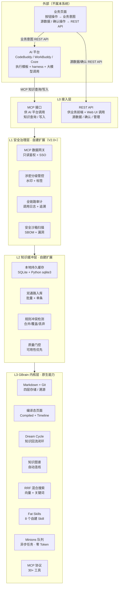
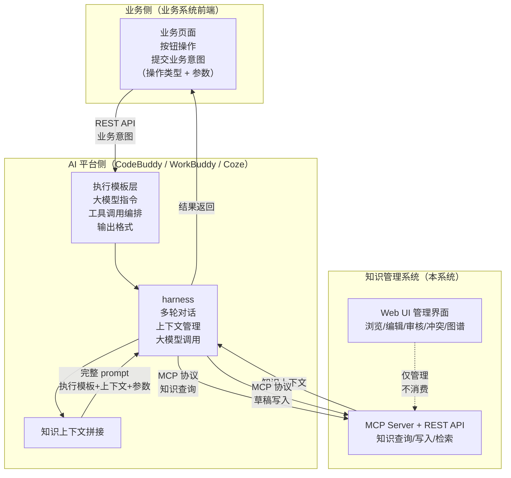
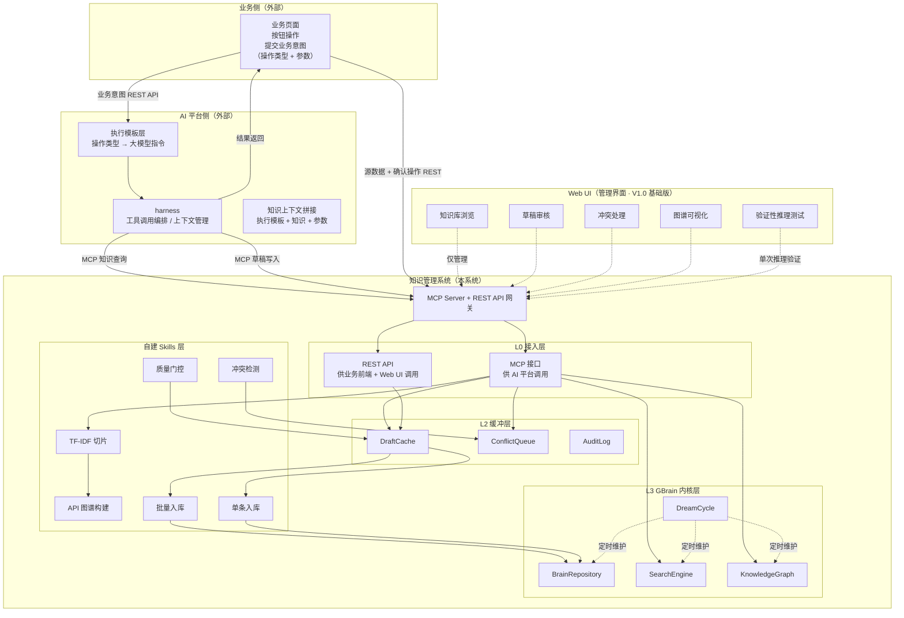
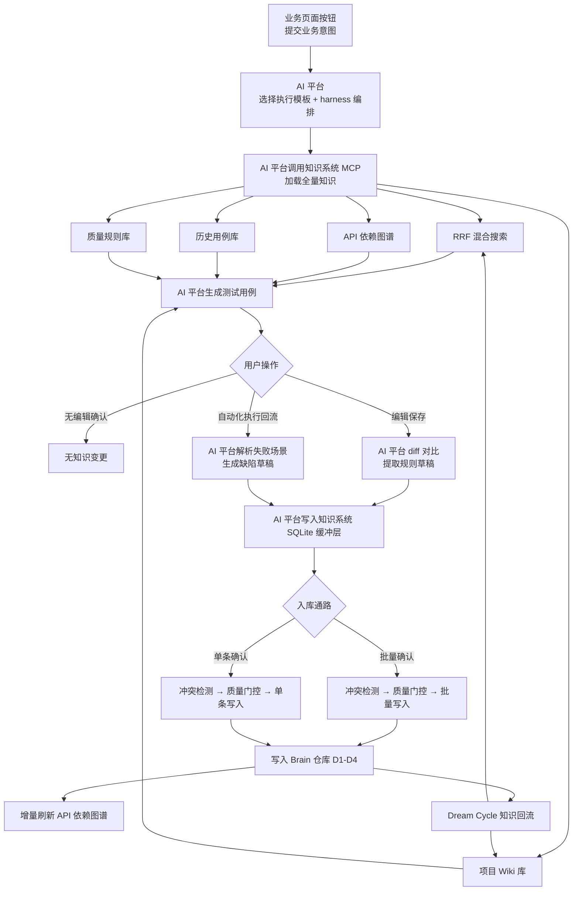
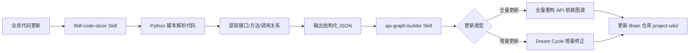
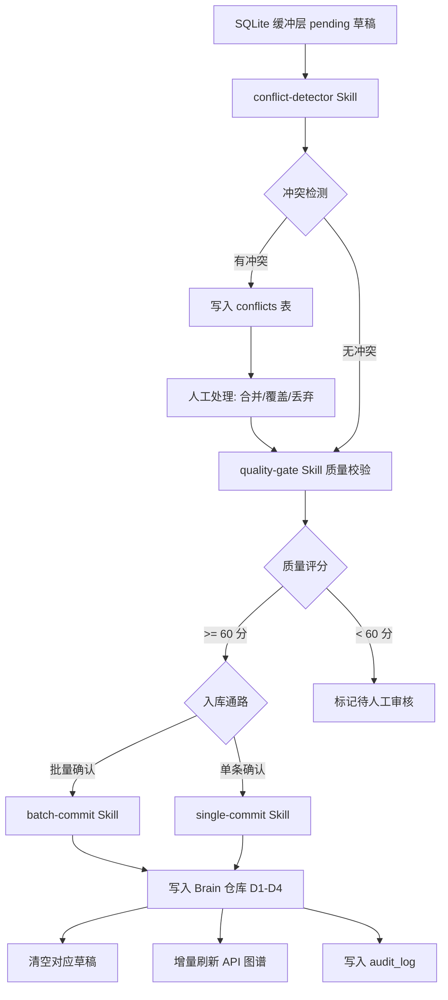
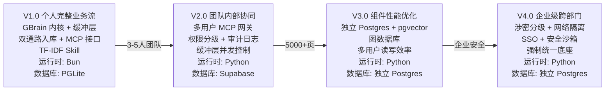
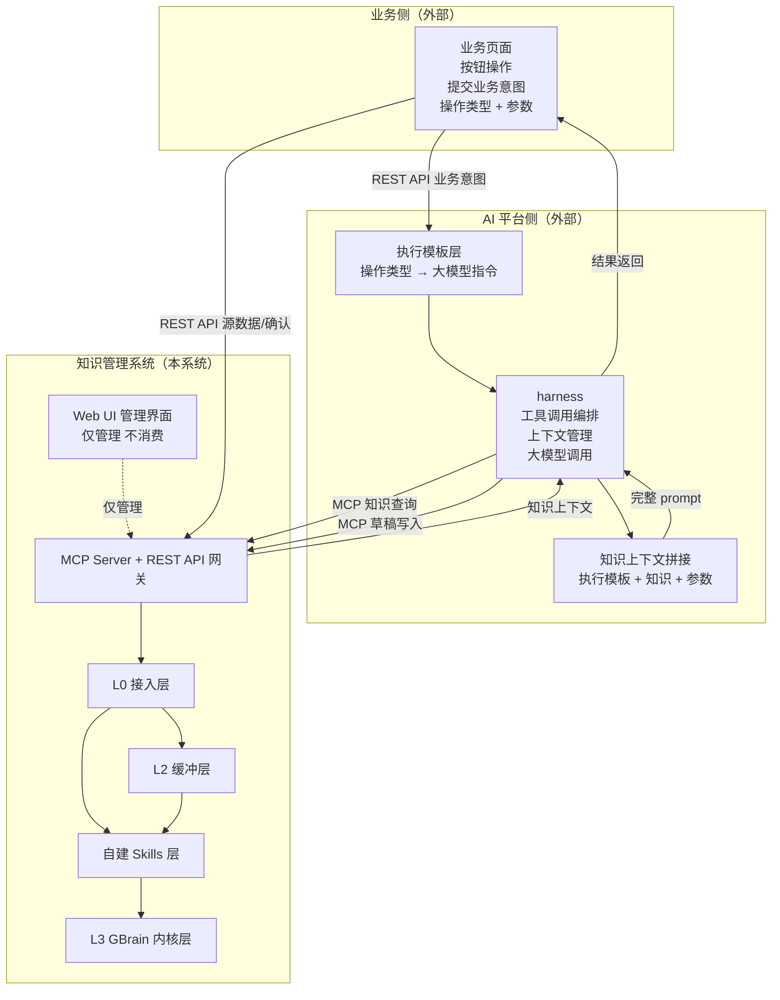

# 通用性知识管理系统 — 总体架构设计

> 基于 GBrain 内核，首先适配 AI 测试用例自动生成系统知识闭环 PRD，后续扩展为通用知识引擎。

---

## 1. 系统定位与设计原则

### 1.1 系统定位

本系统以 **GBrain**（Y Combinator CEO Garry Tan 开源，MIT 协议）为知识管理内核，构建一套**可自我进化、数据闭环、知识可沉淀复用**的通用知识管理系统。系统首先适配《AI 测试用例自动生成系统 — 知识闭环能力 PRD》的完整业务流，后续通过里程碑迭代逐步扩展为团队协同、性能优化、企业级跨部门通用知识引擎。

### 1.2 设计原则

| 原则 | 说明 |
|------|------|
| **内核不改动** | GBrain 核心代码不修改，所有扩展以 Fat Skills（Markdown 技能文件）+ 外部模块形式实现，确保上游升级不冲突 |
| **扩展全走 Skill** | 自定义功能（冲突检测、双通路入库、质量门控等）以 Fat Skills 实现，而非修改 GBrain 源码 |
| **分层解耦** | 安全治理层、知识缓冲层与 GBrain 内核层物理隔离，各层独立迭代 |
| **渐进式演进** | V1.0 个人跑通 → V2.0 团队协同 → V3.0 性能优化 → V4.0 企业级跨部门，每阶段可独立交付 |
| **运行时兼容** | V1.0 全链路使用 Python 3.10+ 实现，GBrain 内核仅作为 CLI 工具通过子进程调用 |

---

## 2. GBrain 内核选型论证

### 2.1 基础信息

| 项目 | 详情 |
|------|------|
| 项目名 | GBrain |
| 作者 | Garry Tan（Y Combinator 现任 CEO） |
| 仓库 | github.com/garrytan/gbrain |
| 协议 | **MIT**（完全开源，允许修改、商用、二次分发） |
| 技术栈 | Python 3.10+ + Flask + SQLite + GBrain CLI（Bun 运行时）+ PGLite 嵌入式 |
| 版本 | v0.16.4 |
| 二次开发可行性 | **高**。MIT 协议 + 模块化引擎接口（PGLite / Postgres 可热迁移）+ Fat Skills 设计（多数技能为 Markdown 文件，可自然语言编辑） |

### 2.2 核心能力与 PRD 需求覆盖矩阵

基于前期对三份附件（播客第 06 期、企业 AI 转型调研报告、AI 测试用例 PRD）的 34 个需求点覆盖分析：

| 覆盖度 | 数量 | 占比 | 说明 |
|--------|------|------|------|
| 原生支持 | 13 | 38% | 开箱即用 |
| 部分支持（需配置） | 10 | 29% | 通过 Skills / MCP 配置 |
| 需二次开发 | 9 | 26% | 需自建扩展模块 |
| 不覆盖 | 2 | 6% | 涉密水印、高密内网隔离（企业级安全治理，外层网关实现） |

**结论**：GBrain 原生覆盖 38% + 配置后覆盖 29% = **67%** 的需求可在 Skill 层面解决，剩余 33% 通过自建缓冲层和安全治理层补齐。内核选型成立。

### 2.3 GBrain 17 项核心能力清单

| 编号 | 能力 | 说明 |
|------|------|------|
| A | Markdown 存储（Git 管理） | 唯一真相源，人类可读可编辑 |
| B | 知识图谱自动连线 | 零 LLM 成本，5 类关系正则抽取 |
| C | 混合搜索（RRF 融合） | 向量 + 关键词，Recall@5 = 95% |
| D | 编译态页面 | Compiled Truth + Timeline 双层结构 |
| E | Dream Cycle 夜间巩固 | 后台扫描、修复引用、丰富实体 |
| F | 三种智能分块 | 递归 / 语义 / LLM 引导 |
| G | Fat Skills 系统 | 26+ 技能，Markdown 定义，可 AI 编辑 |
| H | MCP 协议集成 | 30+ 工具，支持 Claude Code / Cursor / Windsurf |
| I | Minions 任务队列 | Postgres 原生，比 LLM 子 Agent 快 13 倍 |
| J | 数据集成 Recipes | Gmail / Calendar / Twitter / Voice 等 |
| K | 审计溯源 | 每条知识可回溯到原始资料 |
| L | 信任边界分级 | CLI 完整权限 vs MCP 沙箱限制 |
| M | 冲突检测/合并 | 无内建（需扩展） |
| N | 草稿/正式分类 | 无内建显式分层（需扩展） |
| O | MCP 接口隔离 | 双 MCP 实例（查询/写入分离） |
| P | 四层去重 | 页面内优选 / 余弦去重 / 类型多样性 / 单页块上限 |
| Q | 业务系统对接 | CLI / MCP / Minions 三种接入路径 |

---

## 3. 四层分层架构设计

系统采用四层分层架构，自上而下完成业务接入、安全治理、知识缓冲、知识内核存储。

### 3.1 架构总览

> 架构图 SVG 文件：[architecture-overview.svg](./images/architecture-overview.svg)（注：SVG 为初版架构，最新内容以下方 mermaid 图为准）




**颜色说明**：蓝色 = L0 接入层（V1.0 实现） · 珊瑚色 = L1 安全治理层（V2.0+） · 琥珀色 = L2 知识缓冲层（自建） · 绿色 = L3 GBrain 内核层（原生）

### 3.2 软件系统架构视图

#### 3.2.0 系统定位与外部对接关系

本系统的定位是 **知识管理引擎**，不是 AI 智能体平台。系统不重建 Agent harness（工具调用、对话编排、上下文管理等），而是复用外部 AI 智能体平台的 harness 能力。

系统有两侧外部对接：

| 侧 | 对接对象 | 交互方式 | 职责 |
|----|---------|---------|------|
| **业务侧** | 业务系统前端 | REST API | 提交业务意图（操作类型 + 参数），接收结果 |
| **AI 平台侧** | AI 智能体平台（CodeBuddy / WorkBuddy / Coze 等） | MCP 协议 | 复用 harness（工具调用、对话编排、上下文管理），调用大模型，调用知识系统 MCP 接口 |

**关键设计原则**：

1. **知识系统不重建 harness**：知识系统仅通过 MCP 协议暴露知识查询/写入/检索接口。工具调用链、多轮对话、上下文窗口管理、大模型调用均由 AI 智能体平台负责。
2. **业务入口为按钮类确定性操作**：业务页面的所有操作均为按钮触发，提交"业务意图"（操作类型 + 参数），不提交完整 prompt。AI 平台根据操作类型选择预设执行模板，拼接知识上下文后调用大模型。
3. **三层 prompt 分离**：完整的大模型 prompt 由三层拼接，分别归三方管理：
   - **业务意图层**（业务页面管"做什么"）：操作类型 + 业务参数 + 业务约束
   - **执行模板层**（AI 平台管"怎么做"）：大模型指令 + 工具调用编排 + 输出格式
   - **知识上下文层**（知识系统管"知道什么"）：RRF 检索结果 + 知识图谱查询 + Brain 页面
4. **浏览器页面仅用于管理**：Web UI 仅提供知识库管理功能（浏览、编辑、审核、冲突处理、图谱可视化、质量监控），**不**承载日常知识消费和推理。
5. **浏览器上的验证性推理测试**：Web UI 提供一个"推理验证"页面，允许用户输入测试问题，调用知识库做单次检索/推理，验证知识库效果。



**三层 prompt 分离设计**：

| 层 | 归属 | 内容 | 示例 | 换 AI 平台时 |
|----|------|------|------|------------|
| 业务意图 | 业务页面 | 操作类型 + 业务参数 + 业务约束 | `操作=生成用例, PRD文件=xxx.md, 代码路径=src/` | 不变 |
| 执行模板 | AI 平台 | 大模型指令 + 工具调用编排 + 输出格式 | `你是测试用例生成专家，先查询质量规则库，再查询API图谱，然后生成用例...` | 随平台迁移 |
| 知识上下文 | 知识系统 | RRF 检索结果 + 知识图谱查询 + Brain 页面 | 通过 MCP 接口按需返回 | 不变 |

**业务按钮 → 执行模板 → 知识上下文 → 大模型** 完整链路：

| 按钮操作 | 业务意图（业务页面提交） | 执行模板（AI 平台选择） | 知识上下文（知识系统 MCP 返回） |
|---------|----------------------|---------------------|---------------------------|
| 生成用例 | `操作=生成用例, PRD=xxx, 代码=src/` | 生成用例执行模板 | 质量规则 + API 图谱 + 历史用例 + 项目 Wiki |
| 批量入库 | `操作=批量入库, 草稿IDs=[1,2,3]` | 批量入库执行模板 | 冲突检测结果 + 质量评分 |
| 单条入库 | `操作=单条入库, 草稿ID=42` | 单条入库执行模板 | 冲突检测结果 + 质量评分 |
| API 图谱更新 | `操作=图谱更新, 代码路径=src/` | 图谱更新执行模板 | TF-IDF 切片结果 |
| 执行回流 | `操作=执行回流, 测试报告=path` | 执行回流执行模板 | 缺陷规则模板 |

**换 AI 平台时的影响**：业务页面（业务意图）和知识系统（知识上下文）都不需要改动，只需要在新的 AI 平台上重新配置"操作类型 → 执行模板"的映射。

#### 3.2.1 B/S 架构与前后端分离

本系统采用 **B/S 架构（Browser/Server）+ 前后端分离** 开发范式，但 Web UI 的定位是**知识库管理界面**而非日常消费界面：

| 层 | V1.0 | V2.0+ |
|----|------|-------|
| Web UI | 基础 Web UI（功能完整，样式简陋） | 内网 Web 服务（UI 优化：cookie/会话/交互体验） |
| 后端 API 网关 | GBrain MCP Server 直接暴露 | 独立 API 网关（路由/鉴权/审计/限流） |
| AI 智能体平台 | 外部 MCP 客户端调用 | 外部 MCP 客户端 + REST API 调用 |
| 日常知识消费 | MCP 客户端 / CLI | AI 智能体平台通过 MCP 接口完成 |

**Web UI 功能边界**：

| 功能 | 在 Web UI 中 | 说明 |
|------|-------------|------|
| 知识库浏览 | ✅ | 浏览 Brain 仓库中的页面、Timeline、引用关系 |
| 知识页面编辑 | ✅ | 编辑 Markdown 页面，查看 diff |
| 草稿审核 | ✅ | 审核 SQLite 缓冲层中的待入库草稿 |
| 冲突处理 | ✅ | 处理 conflicts 表中的合并/覆盖/丢弃 |
| 图谱可视化 | ✅ | 可视化知识图谱实体和关系 |
| 质量监控 | ✅ | 审计日志、草稿统计、入库趋势 |
| 验证性推理测试 | ✅ | 输入测试问题，单次检索/推理，验证知识库效果 |
| AI 用例生成 | ❌ | 由 AI 智能体平台通过 MCP 接口完成 |
| AI 用例校验 | ❌ | 由 AI 智能体平台通过 MCP 接口完成 |
| 多轮对话 | ❌ | 由 AI 智能体平台 harness 负责 |
| 工具调用编排 | ❌ | 由 AI 智能体平台 harness 负责 |

#### 3.2.1 场景视图（Scenario View）

场景视图描述系统的关键使用场景及其与各层组件的交互。系统作为知识管理引擎，场景分为三类：业务侧场景（业务系统前端发起）、AI 平台侧场景（AI 智能体平台发起）、管理侧场景（Web UI 管理界面）。

**业务侧场景（业务页面 → AI 平台 → 知识系统）**

| 场景 | 触发者 | 交互流程 | 涉及层 |
|------|--------|---------|--------|
| 生成用例 | 业务页面按钮 | 业务意图 → AI 平台执行模板 → MCP 知识查询 → 大模型生成 → MCP 草稿写入 → 结果返回业务页面 | AI 平台 → L3 → L2 |
| 批量入库 | 业务页面按钮 | 业务意图 → AI 平台执行模板 → MCP 冲突检测 → MCP 批量写入 → 结果返回业务页面 | AI 平台 → L2 → L3 |
| 单条入库 | 业务页面按钮 | 业务意图 → AI 平台执行模板 → MCP 冲突检测 → MCP 单条写入 → 结果返回业务页面 | AI 平台 → L2 → L3 |
| API 图谱更新 | 业务页面按钮 | 业务意图 → AI 平台执行模板 → MCP TF-IDF 切片 → MCP 图谱构建 → 结果返回业务页面 | AI 平台 → L0 → L3 |
| 执行回流 | 测试平台回调 | 业务意图 → AI 平台执行模板 → MCP 解析缺陷 → MCP 草稿写入 → 结果返回业务页面 | AI 平台 → L0 → L2 |
| 源数据上传 | 业务页面 | REST API 直连知识系统（不经过 AI 平台） | L0 → L3 |
| 用户确认操作 | 业务页面 | REST API 直连知识系统（不经过 AI 平台） | L0 → L2 → L3 |

**AI 平台侧场景（AI 平台 → 知识系统）**

| 场景 | 触发者 | 交互流程 | 涉及层 |
|------|--------|---------|--------|
| 知识查询 | AI 平台 harness | MCP 协议 → L3 RRF 搜索 + 知识图谱 + Brain 页面 → 返回知识 | L3 |
| 知识写入 | AI 平台 harness | MCP 协议 → L2 草稿写入 → 返回写入结果 | L0 → L2 |
| 探索性推理 | 用户在 AI 平台自然语言提问 | AI 平台 harness 编排 → MCP 知识查询 → 大模型生成 → 结果返回用户 | AI 平台 → L3 |
| 知识回流 | Dream Cycle 定时 | L3 自动 → 修复引用 + 丰富实体 → 回流到 RAG/Wiki | L3 |

**管理侧场景（Web UI 管理界面 → 知识系统）**

| 场景 | 触发者 | 交互流程 | 涉及层 |
|------|--------|---------|--------|
| 知识库浏览 | 管理员 | Web UI → REST API → L3 Brain 仓库浏览 | L3 |
| 草稿审核 | 管理员 | Web UI → REST API → L2 缓冲层 → 审核草稿 | L2 |
| 冲突处理 | 管理员 | Web UI → REST API → L2 conflicts 表 → 合并/覆盖/丢弃 | L2 → L3 |
| 图谱可视化 | 管理员 | Web UI → REST API → L3 知识图谱查询 → 可视化渲染 | L3 |
| 质量监控 | 管理员 | Web UI → REST API → L2 audit_log 统计 → 仪表盘 | L2 |
| 验证性推理测试 | 管理员 | Web UI → MCP 单次查询 → L3 RRF 搜索 → 返回结果（不做多轮对话） | L3 |

> **关键区分**：业务页面的操作均为按钮类确定性操作，提交"业务意图"（操作类型 + 参数）而非完整 prompt。AI 平台根据操作类型选择预设执行模板，从知识系统 MCP 获取知识上下文，拼接成完整 prompt 后调用大模型。Web UI 上的"验证性推理测试"是单次检索/推理，用于验证知识库效果，**不**承载日常知识消费。

#### 3.2.2 逻辑视图（Logical View）

逻辑视图描述系统的模块划分、接口定义和依赖关系。系统定位为**知识管理引擎**，AI 推理能力（工具调用、对话编排、上下文管理）由外部 AI 智能体平台提供。业务页面提交业务意图（操作类型 + 参数），AI 平台负责执行模板选择和 prompt 拼接，知识系统仅提供知识查询/写入接口。



**关键接口说明**：

| 接口 | 协议 | 调用方 | 职责 |
|------|------|--------|------|
| 业务意图提交 | REST | 业务页面 → AI 平台 | 提交操作类型 + 参数，AI 平台选择执行模板 |
| 知识查询 | MCP | AI 平台 harness | RRF 检索、知识图谱查询、Brain 页面读取 |
| 知识写入 | MCP | AI 平台 harness | 草稿写入、正式入库、API 图谱更新 |
| 源数据上传 | REST | 业务页面 → 知识系统 | PRD/代码/缺陷/执行结果上传（不经过 AI 平台） |
| 用户确认操作 | REST | 业务页面 → 知识系统 | 用例确认、规则审核、冲突处理（不经过 AI 平台） |
| 管理操作 | REST | Web UI → 知识系统 | 知识库浏览、编辑、质量监控 |
| 推理验证 | MCP | Web UI（单次） | 输入测试问题，验证知识库效果 |
| harness 能力 | — | AI 平台 | 工具调用、对话编排、上下文管理、大模型调用（**不在本系统重建**） |
| 执行模板管理 | — | AI 平台 | 操作类型 → 执行模板映射（**不在本系统**） |

**三层 prompt 分离原则**：

| 层 | 归属 | 内容 | 换 AI 平台时 |
|----|------|------|------------|
| 业务意图 | 业务页面 | 操作类型 + 业务参数 + 业务约束 | 不变 |
| 执行模板 | AI 平台 | 大模型指令 + 工具调用编排 + 输出格式 | 随平台迁移 |
| 知识上下文 | 知识系统 | RRF 检索结果 + 知识图谱 + Brain 页面 | 不变 |

#### 3.2.3 物理视图（Physical View）

物理视图描述系统的部署拓扑、进程分布和网络连接。系统作为知识管理引擎，与外部 AI 智能体平台和业务系统前端分别部署。

| 组件 | V1.0 部署 | V2.0 部署 | V4.0 部署 |
|------|-----------|-----------|-----------|
| GBrain 核心 | 本机单进程（PGLite 嵌入式） | Supabase 云端数据库 | 独立 Postgres 服务器 |
| MCP Server | 本机 :8100/:8101 | 云端 MCP 服务 | 云端 MCP 服务（SSO 鉴权） |
| SQLite 缓冲层 | 本机文件 | 本机文件 + 并发锁 | 云端数据库 |
| Web UI（管理界面） | 基础 Web UI（功能完整，样式简陋） | 内网 Web 服务 | 企业内网 Web 服务 |
| **AI 智能体平台** | **外部（CodeBuddy/WorkBuddy）** | **外部或内网部署** | **企业内网部署** |
| **业务系统前端** | **外部（CLI 调用）** | **内网 Web 服务** | **企业内网 Web 服务** |
| MCP 网关 | 无 | 内网代理 | 企业网关 + SSO |
| **GBrain 内核 LLM** | **MaaS 平台（向量嵌入/分块，非大模型调用）** | **MaaS 平台（内网）** | **混合云（涉密走私有模型）** |
| 代码仓库 | 本机 Git | 内网 GitLab | 内网 GitLab + 摆渡工单 |

**部署拓扑关键说明**：

- **知识系统不内嵌 AI 推理引擎**：用例生成、校验等推理任务由外部 AI 智能体平台执行，知识系统仅通过 MCP 接口提供知识查询/写入能力。
- **AI 平台 harness 复用**：工具调用链、多轮对话编排、上下文窗口管理、大模型调用均由 AI 智能体平台（CodeBuddy/WorkBuddy/Coze）的 harness 负责，知识系统不重建这些能力。
- **业务前端两条路径**：确定性操作（生成用例/批量入库等）提交业务意图到 AI 平台执行模板 → MCP 调用知识系统；源数据上传/用户确认操作直连知识系统 REST API，不经过 AI 平台。
- **三层 prompt 分离**：业务页面管"做什么"（业务意图），AI 平台管"怎么做"（执行模板），知识系统管"知道什么"（知识上下文）。换 AI 平台时业务页面和知识系统都不需要改动。

#### 3.2.4 处理流程视图（Process View）

处理流程视图描述关键业务流程的端到端数据流转。以下用 mermaid 流程图展示核心流程。

**流程 1：AI 用例生成与知识闭环**



**流程 2：API 依赖图谱更新**



**流程 3：双通路入库**



### 3.2 各层详细说明

#### L0 接入层 · MCP 接口 + REST API

| 组件 | 职责 | V1.0 状态 |
|------|------|-----------|
| MCP 接口 | 供 AI 智能体平台调用，暴露知识查询/写入接口 | ✅ 实现（MCP Server） |
| REST API | 供业务前端 + Web UI 调用，暴露源数据上传/用户确认/管理操作 | ✅ 实现（REST API 网关） |

**设计要点**：L0 接入层不内嵌 AI 推理逻辑（这些是 AI 平台的 harness 职责）。L0 只提供两类接口：MCP 接口（供 AI 平台 harness 调用知识查询/写入）和 REST API（供业务前端提交业务意图/源数据/确认操作，供 Web UI 做管理操作）。大模型调用、工具调用编排、多轮对话由 AI 平台 harness 负责，知识系统不重建。

#### L1 安全治理层（V2.0+ 自建）

| 组件 | 职责 | V1.0 状态 |
|------|------|-----------|
| MCP 数据网关 | 只读鉴权 + SSO + 审计日志 | ❌ V2.0 |
| 涉密分级管控 | 水印注入 + 标签管理 + 强制路由 | ❌ V4.0 |
| 全链路审计 | 调用日志 + 修改追溯 + 合规审计 | ❌ V2.0 |
| 安全沙箱扫描 | SBOM + 漏洞 + 许可证三重扫描 | ❌ V4.0 |

**设计要点**：安全治理层与 GBrain 内核物理解耦，以独立网关形式实现。V1.0 个人使用阶段暂不实现，V2.0 团队协同阶段引入 MCP 网关和审计日志，V4.0 企业级阶段补齐涉密管控和安全沙箱。

#### L2 知识缓冲层（自建，PRD 核心缺口补齐）

| 组件 | 职责 | V1.0 状态 |
|------|------|-----------|
| 本地持久缓存 | 存储待入库规则草稿，重启不丢失 | ✅ SQLite + Python sqlite3 |
| 双通路入库 | 批量确认（主通路）+ 单条提交（兜底通路） | ✅ Fat Skills 实现 |
| 规则冲突检测 | 入库前对比质量规则库，标记合并/覆盖/丢弃 | ✅ Fat Skills 实现 |
| 质量门控 | 可用性优先于数量，只沉淀人工校验过的规则 | ✅ Fat Skills 实现 |

**设计要点**：GBrain 原生的 `import → embed → sync` 是单向流，没有"待入库草稿"中间态。L2 缓冲层在 GBrain 内核前增加一层 SQLite 缓存，承接人工编辑优化和自动化执行回流产生的增量知识草稿，经冲突检测和质量门控后，再通过双通路写入 GBrain 正式知识库。

#### L3 GBrain 内核层（原生能力）

| 组件 | 职责 | PRD 映射 |
|------|------|----------|
| Markdown + Git | 四层存储（只读原始 / 编译态 / Timeline / 索引） | 正式知识持久存储层 D1-D4 |
| 编译态页面 | Compiled Truth + Timeline 双层结构 | 草稿 vs 正式分层 |
| Dream Cycle | 后台扫描、修复引用、丰富实体、知识回流闭环 | 知识回流闭环链路 |
| 知识图谱 | 5 类关系自动连线，零 LLM 成本 | API 依赖图谱（扩展实体类型） |
| RRF 混合搜索 | 向量 + 关键词融合，Recall@5 = 95% | RAG 全局知识库 B1 |
| Fat Skills | 26+ 技能，Markdown 定义，可 AI 编辑 | 所有自建扩展的载体 |
| Minions 任务队列 | Postgres 原生，确定性任务零 Token | API 图谱更新、批量入库等异步任务 |
| MCP 协议 | 30+ 工具，CLI / MCP 双通道 | 双 MCP 接口物理隔离（查询/写入分离） |

---

## 4. PRD 四层架构映射

PRD 定义了四层架构（知识输入源层 / AI 知识加工层 / 临时知识缓冲层 / 正式知识持久存储层），与本系统的四层架构映射关系如下：

> 映射图 SVG 文件：[prd-mapping.svg](./images/prd-mapping.svg)（注：SVG 为初版架构，最新内容以下方 mermaid 图为准）

```mermaid
graph LR
    subgraph PRD["PRD 原始架构"]
        P1[知识输入源层<br/>A1-A5]
        P2[AI 知识加工层<br/>B1-B5]
        P3[临时知识缓冲层<br/>C 本地持久缓存]
        P4[正式知识持久存储层<br/>D1-D4]
    end

    subgraph SYS["系统目标架构"]
        S0[L0 接入层<br/>MCP 接口 + REST API]
        S2[L2 知识缓冲层<br/>SQLite + 双通路入库]
        S3[L3 GBrain 内核层<br/>Brain 仓库 + RRF + 知识图谱]
        S1[L1 安全治理层<br/>V2.0+ 自建]
    end

    P1 -->|GBrain import + TF-IDF Skill| S0
    P2 -->|RRF + 图谱 + MCP 接口 供 AI 平台调用| S0
    P3 -->|SQLite 缓冲层 自建| S2
    P4 -->|单 Brain 仓库分目录| S3
    P2 -->|Dream Cycle + Fat Skills| S3
    PRD -.->|PRD 无对应层 V4.0 补齐| S1
```




### 4.1 PRD 知识输入源层 → 系统输入模块

| PRD 组件 | 系统实现 | 实现方式 |
|---------|---------|---------|
| A1 PRD/流程图 | GBrain import + Markdown frontmatter | `gbrain import` 命令导入 |
| A2 TF-IDF 代码切片 | 自建 `tfidf-code-slicer` Skill | Python 脚本解析代码，Minions 任务调度 |
| A3 历史用例库存量 | GBrain Brain 仓库 `test-cases/` 目录 | Markdown 页面，frontmatter 含用例元数据 |
| A4 JIRA 缺陷素材 | GBrain Brain 仓库 `defect-experience/` 目录 | Markdown 页面，frontmatter 含缺陷元数据 |
| A5 自动化执行结果 | 自建执行回流 Skill | 解析测试报告，生成缺陷类规则草稿 |

### 4.2 PRD AI 知识加工层 → 系统加工模块

| PRD 组件 | 系统实现 | 实现方式 |
|---------|---------|---------|
| B1 RAG 全局知识库 | GBrain RRF 混合搜索 | 向量 + 关键词融合检索 |
| B2 LM Wiki 项目知识库 | GBrain Brain 仓库 `project-wiki/` 目录 | 编译态页面结构 |
| B3 API 依赖图谱 | GBrain 知识图谱 + 自建 `api-graph-builder` Skill | 实体类型扩展为 API/方法/调用关系 |
| B4 生成接口 | MCP 接口（供 AI 平台 harness 调用） | AI 平台通过 MCP 获取知识 + 生成用例 + 写入草稿 |
| B5 校验接口 | MCP 接口（供 AI 平台 harness 调用） | AI 平台通过 MCP 获取质量规则 + 校验 + 写入正式库 |

### 4.3 PRD 临时知识缓冲层 → 系统缓冲层（L2）

| PRD 组件 | 系统实现 | 实现方式 |
|---------|---------|---------|
| C 本地持久缓存 | SQLite（Python sqlite3） | drafts 表 + conflicts 表 + audit_log 表 |
| 双通路入库 | `batch-commit` + `single-commit` 两个 Fat Skills | 共用冲突检测逻辑 |
| 缓冲规则约束 | 缓存仅入库成功后清除 | Skill 内强制校验 |

### 4.4 PRD 正式知识持久存储层 → GBrain Brain 仓库（L3）

| PRD 组件 | 系统实现 | 目录映射 |
|---------|---------|---------|
| D1 质量规则知识库 | GBrain Brain 仓库 | `brain/quality-rules/` |
| D2 缺陷经验库 | GBrain Brain 仓库 | `brain/defect-experience/` |
| D3 LM Wiki 项目知识库 | GBrain Brain 仓库 | `brain/project-wiki/` |
| D4 历史测试用例库 | GBrain Brain 仓库 | `brain/test-cases/` |

**单仓库分目录设计**：四个知识库在同一个 Brain 仓库内用目录区分，跨库检索无需切换，Dream Cycle 统一维护。

### 4.5 PRD 知识流转链路 → Skill 调用序列映射

| PRD 链路 | 触发条件 | 调用 Skill 序列 | 数据流向 |
|---------|---------|----------------|---------|
| API 依赖图谱更新 | 代码变更 / 知识库变更 | `tfidf-code-slicer` → `api-graph-builder` | A2/D3/D4 → B3 |
| AI 用例只读生成 | 用户触发生成 | `case-generator`（读 B1/B2/B3/D4/D1） | 全量只读 → 输出用例 |
| 临时草稿生成 | 人工编辑保存 / 执行回流 | `case-generator` diff → 缓存写入 | B4 → C（SQLite） |
| 批量入库 | 用户批量确认 | `conflict-detector` → `batch-commit` → `api-graph-builder` | C → D1/D2/D3/D4 |
| 单条入库 | 用户单条确认 | `conflict-detector` → `single-commit` → `api-graph-builder` | C → D1/D2/D3/D4 |
| 知识回流闭环 | Dream Cycle 定时触发 | `gbrain sync` → `gbrain embed --stale` | D1-D4 → B1/B2 |

---

## 5. 里程碑版本路线图

### 5.1 四阶段演进总览

> 路线图 SVG 文件：[milestone-roadmap.svg](./images/milestone-roadmap.svg)（在浏览器中打开可查看高清版）




### 5.2 各版本详细说明

#### V1.0 个人完整业务流

| 维度 | 说明 |
|------|------|
| **核心目标** | 单人完整跑通 PRD 定义的知识闭环（生成→优化→沉淀→再生成） |
| **前置条件** | GBrain 已安装、MaaS 平台可用（GBrain 内核向量嵌入/分块用）、Python 3.10+ 环境 |
| **关键交付** | GBrain 内核 + L2 缓冲层 + 双通路入库 + 冲突检测 + TF-IDF Skill + MCP 接口 + API 依赖图谱 + 基础 Web UI |
| **不含** | 多用户协同、权限分级、涉密管控、性能优化 |
| **运行时** | Python 3.10+ |
| **LLM** | GBrain 内核 LLM（向量嵌入/分块） | MaaS 平台（OpenAI 兼容） | 同 V1.0 |
| **数据库** | PGLite 嵌入式（零配置） |
| **仓库结构** | 单 Brain 仓库分目录（quality-rules / defect-experience / project-wiki / test-cases） |
| **自建 Skill** | 8 个（tfidf-code-slicer / case-generator / case-validator / conflict-detector / batch-commit / single-commit / api-graph-builder / quality-gate） |

#### V2.0 团队内部协同

| 维度 | 说明 |
|------|------|
| **核心目标** | 3-5 人团队协同读写，知识库共享与权限分级 |
| **前置条件** | V1.0 稳定运行，团队成员具备基本 GBrain 操作能力 |
| **关键交付** | 多用户 MCP 网关 + 权限分级（读/写/管理）+ 审计日志 + 缓冲层并发控制（锁机制）+ 质量门控 + Web UI 优化（React/Vue SPA + cookie/会话/交互体验）+ 运行时切换评估 |
| **运行时** | Python 3.10+，GBrain CLI 通过子进程调用，自建模块与内核解耦 |
| **数据库** | Supabase（Pro 版 $25/月，8GB），支持多用户并发 |

#### V3.0 组件性能优化

| 维度 | 说明 |
|------|------|
| **核心目标** | 消除性能瓶颈，支撑大规模知识库（万级页面） |
| **前置条件** | V2.0 稳定运行，知识库规模超过 5000 页面 |
| **关键交付** | 独立 Postgres + pgvector（脱离 Supabase 免费版限制）+ 图数据库（Neo4j 或 Apache AGE）+ 多用户读写效率优化 + 图谱计算性能优化 |
| **技术变化** | PGLite → Supabase → 独立 Postgres；知识图谱从 GBrain 内置 SQLite 迁移到独立图数据库 |

#### V4.0 企业级跨部门

| 维度 | 说明 |
|------|------|
| **核心目标** | 跨部门、跨平台、多权限的企业级部署 |
| **前置条件** | V3.0 性能达标，企业安全策略已制定 |
| **关键交付** | 涉密分级管控（水印 + 标签 + 强制路由）+ 网络隔离（高密内网闭环）+ SSO 集成 + 安全沙箱扫描（SBOM + 漏洞 + 许可证）+ 强制统一底座 + 全链路审计 |
| **安全治理层** | L1 安全治理层全部实现，独立网关部署 |

### 5.3 版本间演进原则

1. **不破坏 V1.0 架构**：每个版本的扩展以新增模块为主，不改动 V1.0 的核心设计
2. **Skill 优先**：新增功能优先以 Fat Skills 实现，避免修改 GBrain 核心代码
3. **数据兼容**：版本升级时 Brain 仓库目录结构不变，新增字段以 frontmatter 扩展
4. **运行时兼容**：V1.0 全链路使用 Node.js 兼容语法，V2.0 评估切换时自建模块零改动

---

## 6. 运行时设计

### 6.1 设计目标

V1.0 全链路使用 Python 3.10+ 实现。GBrain 内核仍使用 Bun 运行时，但仅作为 CLI 工具通过子进程调用，自建模块与 GBrain 内核完全解耦。

### 6.2 技术栈

| 层面 | 技术 | 说明 |
|------|------|------|
| 自建模块 | Python 3.10+ | REST API、MCP 服务器、缓冲层、Skills |
| Web 框架 | Flask | REST API 网关 |
| MCP 框架 | Python mcp SDK | 双 MCP 服务器实现 |
| SQLite | Python sqlite3 | 标准库，无需额外编译 |
| 包管理 | pip / uv | `requirements.txt` |
| 测试 | pytest | 单元测试与集成测试 |
| GBrain CLI | Bun 运行时 | 仅调用 `gbrain` 命令 |

### 6.3 检查清单

- [ ] Python 3.10+ 已安装
- [ ] `pip install -r requirements.txt` 成功
- [ ] `gbrain` CLI 全局可用
- [ ] `pytest` 测试通过

---

## 7. GBrain 内核 LLM 配置（非大模型调用）

**重要区分**：本节的 LLM 配置是 GBrain 内核自身运行所需的（向量嵌入、智能分块），**不是**知识系统调用大模型生成用例。大模型调用（用例生成、用例校验等推理任务）由 AI 智能体平台的 harness 负责，知识系统不配置大模型。

### 7.1 接入方式

GBrain 内核原生使用 OpenAI SDK，通过修改 `OPENAI_BASE_URL` 指向 MaaS 平台即可适配本地模型。此配置仅用于 GBrain 内核的向量嵌入和智能分块，不用于大模型推理。

### 7.2 配置

```bash
# GBrain 内核 LLM 配置（向量嵌入/分块，非大模型调用）
export OPENAI_API_KEY="<MaaS 平台 API Key>"
export OPENAI_BASE_URL="https://maas.icompify.com:32788/v1"
# 不配置 ANTHROPIC_API_KEY（多查询扩展由 AI 平台 harness 负责，不在知识系统内）
```

### 7.3 模型分工

| 功能 | 需要 LLM | 模型/方式 | 接口 | 说明 |
|------|---------|---------|------|------|
| 向量嵌入 | 是 | MaaS embedding 模型 | /v1/embeddings | GBrain 内核检索能力 |
| 智能分块 | 是 | Qwen / DeepSeek | /v1/chat/completions | GBrain 内核分块能力 |
| 知识图谱连线 | 否 | 正则规则引擎 | — | 零 Token 成本 |
| Minions 任务 | 否 | Postgres 原生 | — | 确定性操作零 Token |
| 冲突检测 | 否 | 规则引擎 | — | 零 Token 成本 |
| 质量门控 | 否 | 规则引擎 | — | 零 Token 成本 |
| 用例生成 | **不在本系统** | AI 平台大模型 | AI 平台 harness | AI 平台负责 |
| 用例校验 | **不在本系统** | AI 平台大模型 | AI 平台 harness | AI 平台负责 |
| 多查询扩展 | **不在本系统** | AI 平台大模型 | AI 平台 harness | AI 平台负责 |

### 7.4 降级方案

| 场景 | 降级策略 |
|------|---------|
| MaaS 不提供 /v1/embeddings | V1.0 先用关键词检索（GBrain 原生支持），V2.0 再接向量 |
| MaaS 不提供 /v1/chat/completions | 跳过智能分块，使用递归分块（GBrain 默认策略） |
| 无 LLM 可用 | GBrain 内核退化为纯关键词检索 + 递归分块，知识图谱连线 + Minions 任务 + 冲突检测 + 质量门控均正常工作（零 LLM 依赖） |

---

## 8. 风险与缓解措施

| 风险 | 影响 | 缓解措施 |
|------|------|---------|
| GBrain 版本迭代快（v0.16.4），API 可能不稳定 | 自建 Skill 可能需要适配 | 所有扩展用 Fat Skills 实现，不修改核心代码；锁定版本 tag |
| Python 生态依赖 | 团队学习成本 | V1.0 统一 Python，降低多语言切换成本 |
| 知识图谱是实体关系，非 API 调用关系 | PRD 的 API 依赖图谱需求无法直接复用 | 自建 TF-IDF 切片 Skill，将 API 实体建模为 GBrain 实体类型 |
| 无内建质量门控 | 垃圾知识可能入库 | 在入库 Skill 中增加 Minions 质量校验任务 |
| 企业级安全治理完全缺失 | 涉密数据泄露风险 | V1.0 个人使用暂不涉及，V4.0 外层独立网关实现 |
| MaaS 平台接口兼容性未知 | 向量检索/LLM 分块可能不可用 | 降级方案：关键词检索 + 递归分块 |

---

## 9. 开发视图（Development View）

开发视图描述系统的代码组织、模块划分、技术栈分层和构建方式。

### 9.1 技术栈分层

| 层 | 技术选型 | V1.0 | V2.0+ |
|----|---------|------|-------|
| **业务系统前端** | 外部系统 | 业务系统自有前端 | 通过 REST API 对接知识系统 |
| **AI 智能体平台** | 外部系统（CodeBuddy/WorkBuddy/Coze） | MCP 客户端调用 | MCP + REST API 调用，**复用平台 harness** |
| **Web UI（管理界面）** | **基础 Web UI（功能完整，样式简陋）** | **React/Vue 优化版（cookie/会话/交互体验）** |
| **后端 API 网关** | GBrain MCP Server | 内嵌 | 独立 API 网关 + MCP 代理 |
| **缓冲层** | SQLite (Python sqlite3) | Python 标准库 | 同 V1.0 |
| **自建 Skills** | Markdown 文件 | Fat Skills 定义 | 同 V1.0 |
| **内核** | GBrain 0.42.x | Bun 运行时（仅 CLI） | 与自建模块解耦 |
| **LLM** | MaaS 平台（GBrain 内核向量嵌入/分块用） | OpenAI 兼容接口 | 同 V1.0 |
| **TF-IDF** | Python 3.10+ | 子进程调用 | 同 V1.0 |
| **数据库** | PGLite | 嵌入式 | Supabase → 独立 Postgres |

### 9.2 代码组织

```
test-knowledge-system/
├── brain/                    # GBrain Brain 仓库（Git 管理）
├── skills/                   # 自建 Fat Skills（8 个，Markdown）
├── cache/                    # L2 缓冲层（SQLite）
├── agents/                   # MCP 接口配置（供 AI 平台调用）
├── api/                      # REST API 网关（供业务前端 + Web UI 调用）
├── web/                      # Web UI 管理界面（V1.0 基础版，V2.0 优化）
├── config/                   # 系统配置
├── scripts/                  # 运维脚本（Python / Shell）
├── images/                   # 架构图 / UML 图
├── docs/                     # 设计文档
├── package.json              # 依赖声明（bun + node 双声明）
└── .env.example              # 环境变量模板
```

### 9.3 外部对接架构（业务侧 + AI 平台侧 + 三层 prompt 分离）

本系统作为知识管理引擎，有两侧外部对接，**不重建 AI harness**。业务页面提交业务意图（操作类型 + 参数），AI 平台负责执行模板选择和 prompt 拼接，知识系统仅提供知识查询/写入接口。



**核心原则**：

1. **三层 prompt 分离**：业务页面管"做什么"（业务意图），AI 平台管"怎么做"（执行模板），知识系统管"知道什么"（知识上下文）。完整 prompt = 执行模板 + 知识上下文 + 业务参数，由 AI 平台拼接。
2. **业务入口为按钮类确定性操作**：业务页面所有操作均为按钮触发，提交"业务意图"（操作类型 + 参数），不提交完整 prompt。AI 平台根据操作类型选择预设执行模板。
3. **harness 复用**：工具调用链、多轮对话编排、上下文窗口管理、大模型调用均为 AI 平台职责，知识系统不重建。
4. **业务前端两条路径**：确定性操作（生成用例/批量入库等）→ 业务意图 → AI 平台执行模板 → MCP 调用知识系统；源数据上传/用户确认操作 → REST API 直连知识系统，不经过 AI 平台。
5. **Web UI 仅管理**：知识库浏览、编辑、审核、冲突处理、图谱可视化、验证性推理测试，不承载日常知识消费和推理。
6. **换 AI 平台零改动**：业务页面（业务意图）和知识系统（知识上下文）都不需要改动，只需要在新的 AI 平台上重新配置"操作类型 → 执行模板"的映射。

**业务按钮 → 执行模板 → 知识上下文 → 大模型** 完整链路：

| 按钮操作 | 业务意图（业务页面） | 执行模板（AI 平台） | 知识上下文（知识系统 MCP） |
|---------|---------------------|---------------------|---------------------------|
| 生成用例 | `操作=生成用例, PRD=xxx, 代码=src/` | 生成用例执行模板 | 质量规则 + API 图谱 + 历史用例 + 项目 Wiki |
| 批量入库 | `操作=批量入库, 草稿IDs=[1,2,3]` | 批量入库执行模板 | 冲突检测结果 + 质量评分 |
| 单条入库 | `操作=单条入库, 草稿ID=42` | 单条入库执行模板 | 冲突检测结果 + 质量评分 |
| API 图谱更新 | `操作=图谱更新, 代码路径=src/` | 图谱更新执行模板 | TF-IDF 切片结果 |
| 执行回流 | `操作=执行回流, 测试报告=path` | 执行回流执行模板 | 缺陷规则模板 |

### 9.4 前后端分离开发范式（B/S 架构）

本系统采用 **B/S 架构（Browser/Server）+ 前后端分离** 开发范式，但 Web UI 的定位是**知识库管理界面**而非日常消费界面：

- **Web UI（管理界面）**：V1.0 提供基础 Web UI（功能完整，样式简陋），通过 REST API 调用后端。V2.0 升级为 React/Vue SPA，优化 cookie/会话/交互体验。
- **后端 API 网关**：V2.0 起引入独立 API 网关，负责路由、鉴权、审计日志、请求限流。V1.0 阶段由 GBrain MCP Server 直接提供接口。
- **AI 智能体平台对接**：外部 AI 平台（CodeBuddy/WorkBuddy/Coze）通过 MCP 协议调用知识系统的知识查询/写入接口，复用平台自身的 harness 能力（工具调用、对话编排、上下文管理），知识系统不重建这些能力。
- **业务系统前端对接**：业务系统前端通过 REST API 直连知识系统，上传源数据（PRD/代码/缺陷/执行结果）和提交用户确认操作（用例确认/规则审核/冲突处理）。
- **数据层**：GBrain Brain 仓库（Markdown + Git）+ SQLite 缓冲层，与前端和 AI 平台均解耦。
- **Skill 层**：所有业务逻辑封装在 Fat Skills 中，后端 API 网关和 MCP Server 共享同一套 Skill 定义。

### 9.4 构建与部署

| 阶段 | 构建方式 | 部署方式 |
|------|---------|---------|
| V1.0 | `bun install && bun link` + 基础 Web UI（HTML/JS） | 本机单进程 + 基础 Web UI，`gbrain init` 初始化 |
| V2.0 | `npm install` + 前端 `npm run build`（React/Vue SPA） | 内网 Web 服务 + MCP Server + UI 优化 |
| V3.0 | Docker Compose | 独立 Postgres + 前端容器 + 后端容器 |
| V4.0 | Kubernetes | 多容器编排 + SSO 网关 + 安全沙箱 |
